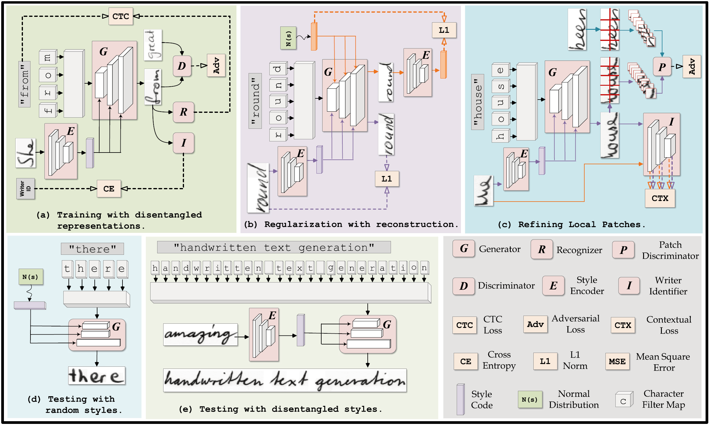
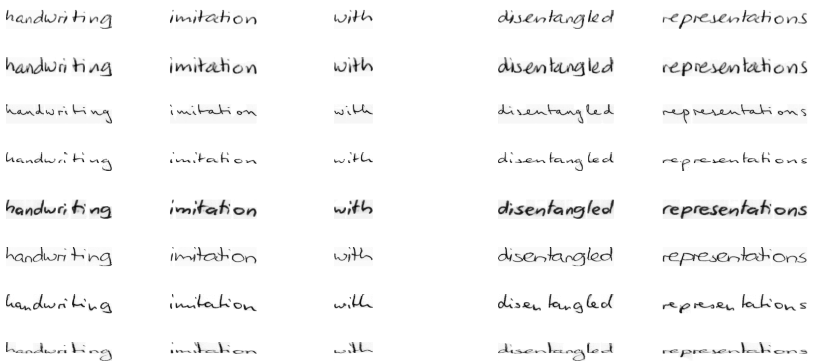
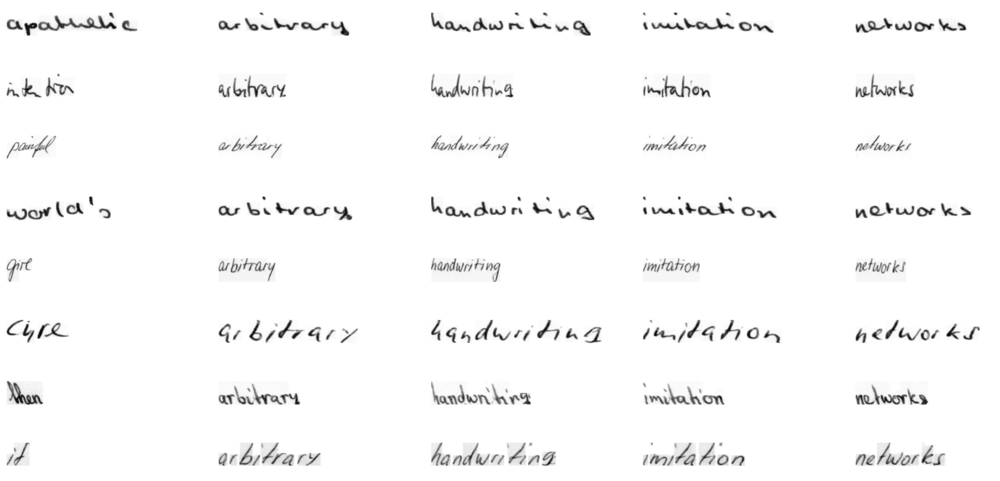
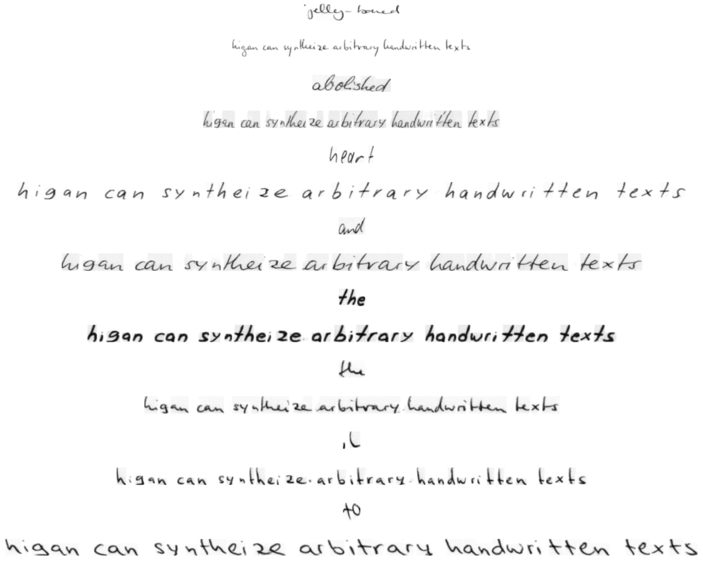
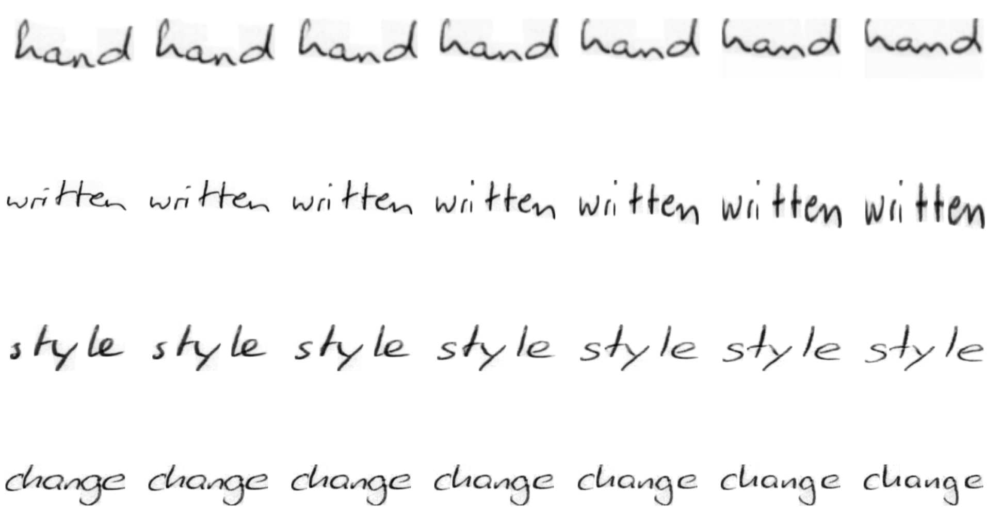
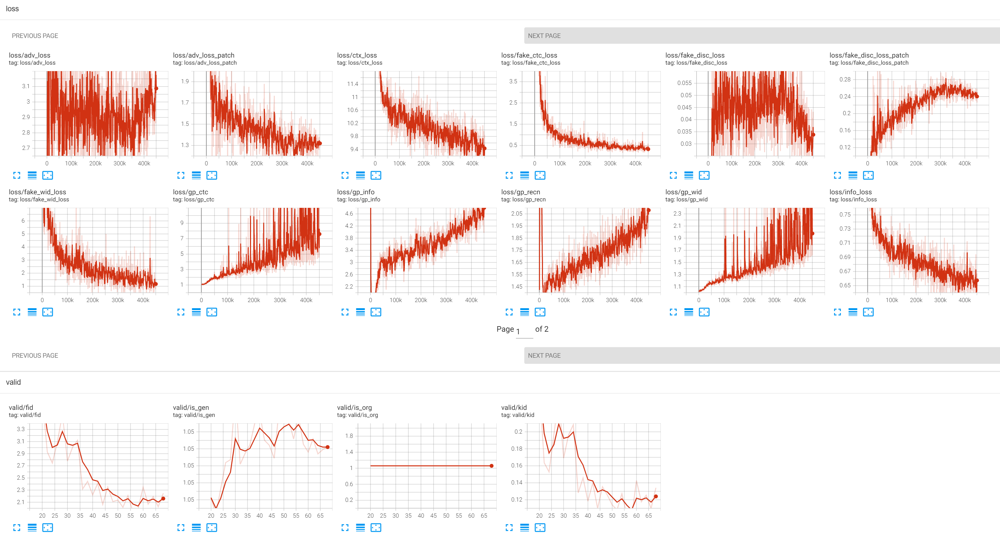
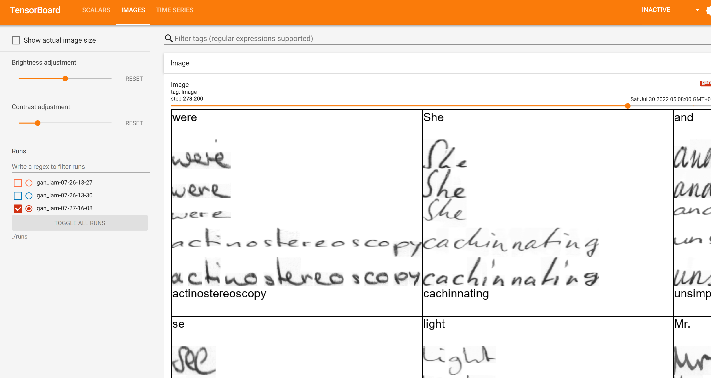

# HiGAN+

## Introduction
This is a PyTorch implementation of the paper **"HiGAN+: Handwriting Imitation GAN with Disentangled
Representations"** (authored by **Ji Gan, Weiwiang Wang\*, Jiaxu Leng, Xinbo Gao\*.** )

HiGAN+ can generate diverse and realistic handwritten text images (with **64**-pixel height) conditioned
on arbitrary textual contents and calligraphic styles.

## Overview of HiGAN+



## Installation & requirements
The current version of the code has been tested with the following environment:
- Ubuntu 20 or 22
- Python 3
- PyTorch 1.11.0


To use the code, download the repository and change into it:

`git clone https://github.com/ganji15/HiGANplus.git`

`cd HiGAN+`

You need to applicant the IAM dataset from <http://www.fki.inf.unibe.ch/databases/iam-handwriting-database> and then extract the handwriting images. 
For convenience, here we provide the processed h5py files [trnvalset_words64_OrgSz.hdf5](https://github.com/ganji15/HiGANplus/releases/download/dataset/trnvalset_words64_OrgSz.hdf5)  [testset_words64_OrgSz.hdf5](https://github.com/ganji15/HiGANplus/releases/download/dataset/testset_words64_OrgSz.hdf5), which should put into the **./data/iam/** directory.


## Training & Test
### Training HiGAN on the IAM dataset
`python train.py --config ./configs/gan_iam.yml`

### Quantitative Test
`python test.py --config ./configs/gan_iam.yml --ckpt ./pretrained/deploy_HiGAN+.pth --guided True`
+ Main arguments:
  - `--config`: the configuration file of HiGAN
  - `--ckpt`: the path of checkpoint, which is stored in the `./runs/` directory after training.
  - `--guided`: whether to extract styles from reference images. If `--guided False`, the styles of generated images will be randomly sampled from the standard normal distribution.

### Qualitative Evaluation
`python eval_demo.py --config ./configs/gan_iam.yml --ckpt ./pretrained/deploy_HiGAN+.pth --mode style`
+ Main arguments:
  - `--config`: the configuration file of HiGAN
  - `--ckpt`: the path of checkpoint, which is stored in the `./runs/` directory after training.
  - `--mode`: `[ rand | style | interp | text ]`.

#### Latent-guided synthesis
`python eval_demo.py --config ./configs/gan_iam.yml --ckpt ./pretrained/deploy_HiGAN+.pth --mode rand`


#### Reference-guided synthesis
`python eval_demo.py --config ./configs/gan_iam.yml --ckpt ./pretrained/deploy_HiGAN+.pth --mode style`


#### Text synthesis
`python eval_demo.py --config ./configs/gan_iam.yml --ckpt ./pretrained/deploy_HiGAN+.pth --mode text`


#### Style interpolation
`python eval_demo.py --config ./configs/gan_iam.yml --ckpt ./pretrained/deploy_HiGAN+.pth --mode interp`



## On-the-fly plots during training
With this code it is possible to track progress during training with on-the-fly plots. This feature requires `Tensorboard`, which should be started from the command line:

`tensorboard --logdir=./runs`

The tensorboard server is now alive and can be accessed at http://localhost:6006.

Some on-the-fly plots are given as the followings:




## Citation
If you find our research is helpful, please remember to cite our paper:
```
@article{gan2022higanplus,
author = {Gan, Ji and Wang, Weiqiang and Leng, Jiaxu and Gao, Xinbo},
title = {HiGAN+: Handwriting Imitation GAN with Disentangled Representations},
year = {2022},
volume = {42},
number = {1},
url = {https://doi.org/10.1145/3550070},
doi = {10.1145/3550070},
journal = {ACM Trans. Graph.}
}
```

## License
HiGAN+ is free for academic research purposes.
